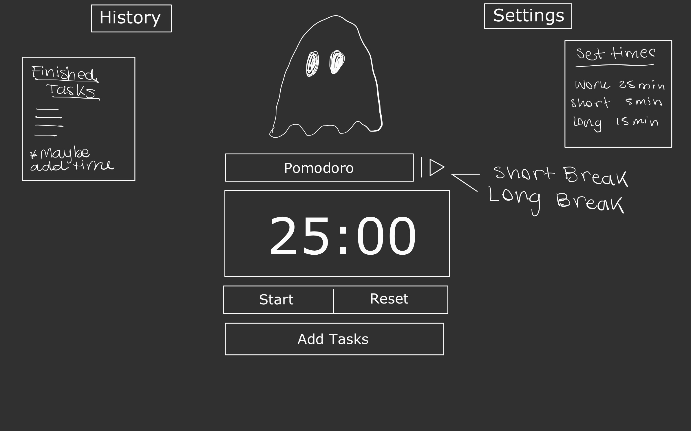

# Ghost Pomodoro

## 🎨 Design

## 🎯 Features

- Add the pomodoro flow to automatic change timer ✅
- Add custom times
- Save history of accomplishments
- When user finishes a task - use confetti API
- When timer finishes - add a Boo Sound and move the ghost around the screen to alert users
- Possibility to add music and/or add a playlist from Spotify API
- Toggle to default pomodoro flow or to user choose manually
- Add unit tests
- Add notifications when timer finishes

## ⚙️ Installation & Usage

- Clone or download the repo
- `npm install` to install all dependencies
- `npm run dev` to launch server

## 💻 Technologies

## 👀 Demo

## ✨ Inspiration

- [Viki-code Ghost](https://codepen.io/viki-code/pen/gOqbjLN)
- [Pomodoro Kitty](https://pomodorokitty.com/)
- [Pomofocus](https://pomofocus.io/)
- [studywithme.io](https://studywithme.io/aesthetic-pomodoro-timer/)

## 📚 Lessons Learned

- How to use, style and add SVG images to components
- How to create and use custom hooks
- How to use reactjs-popup library

## ⚖️ License

GNU General Public License v3.0
